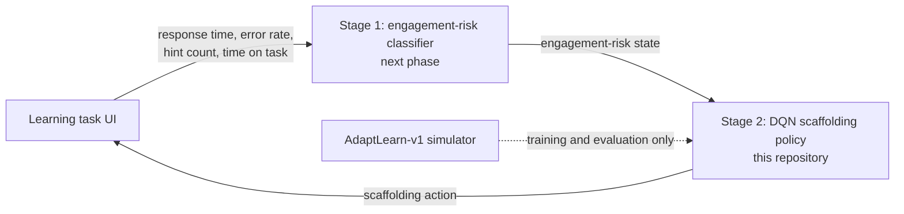
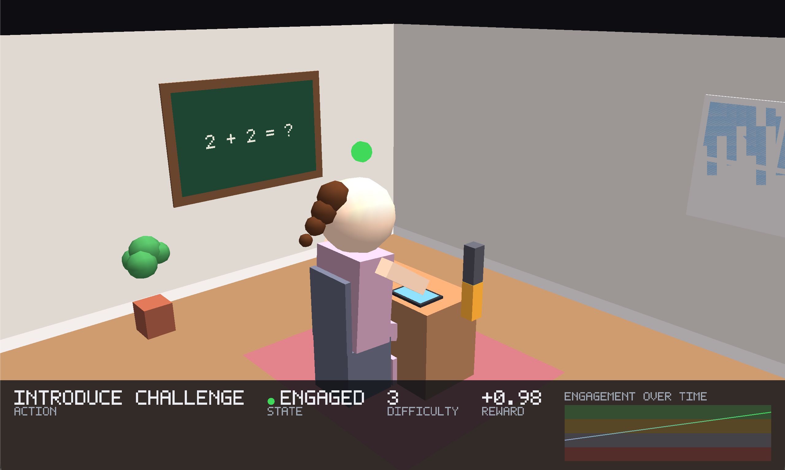
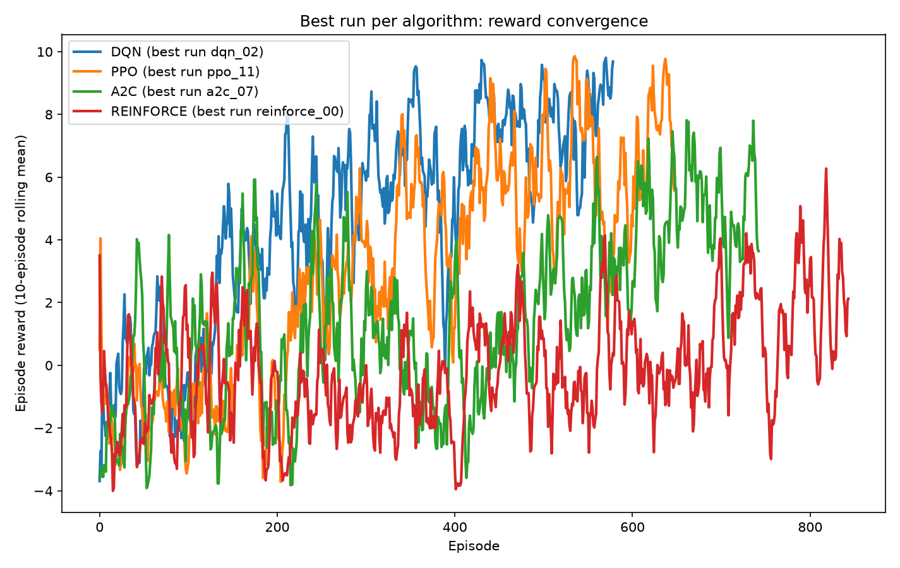
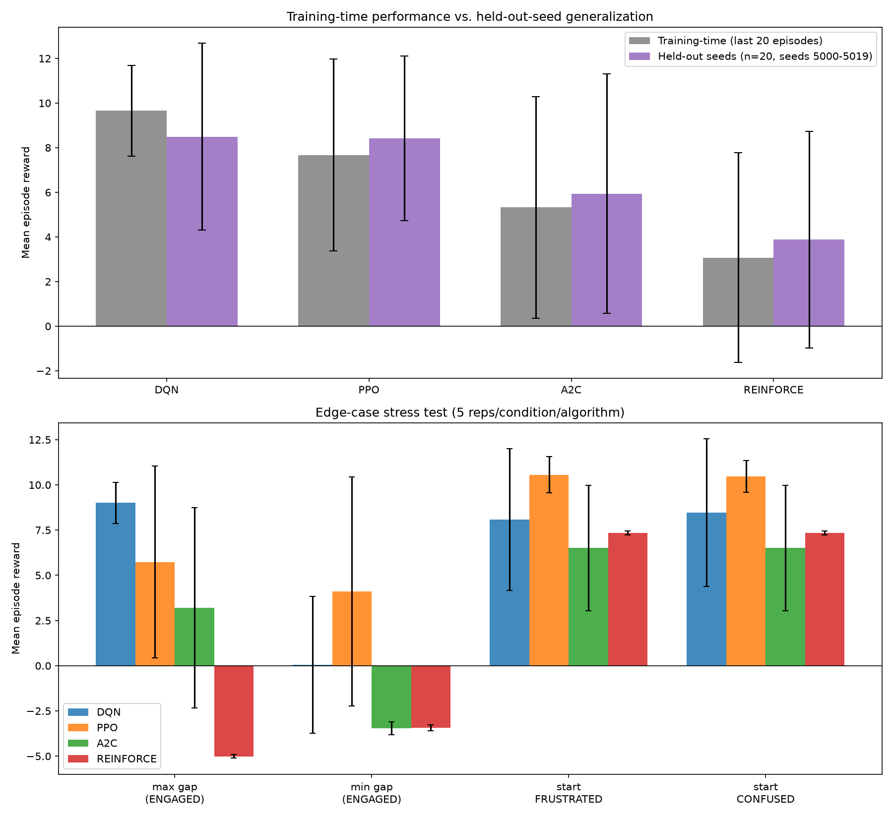

# SensAI

SensAI is my BSc Software Engineering capstone at African Leadership University. It is a two-stage system for school-age learners aged 8–14:

1. **Stage 1** reads non-invasive telemetry from a learning task (response time, error rate, hint count, time on task) and estimates a behavioural engagement-risk state.
2. **Stage 2** takes that state and picks an instructional scaffolding action (for example lower the difficulty, offer a hint, encourage, move to the next topic) using a DQN policy.

**This repository is the Stage 2 prototype.** The policy is trained and evaluated entirely in simulation, in a custom Gymnasium environment called `AdaptLearn-v1`, and is served through a FastAPI app. Stage 1 and the pilot with real learners are the next phase and are not in this repository yet.

The simulator names its four learner states `FRUSTRATED`, `BORED`, `CONFUSED` and `ENGAGED`. Those are labels for simulated states. SensAI works with behavioural engagement inferred from interaction signals and does not claim to detect emotions in real children. Results here show how the policy behaves under the simulator's assumptions, not learning gains in a classroom.

- **Repository:** https://github.com/S1rDavid9/SensAI_capstone
- **Model notebook:** [`ModelNotebook.ipynb`](ModelNotebook.ipynb)
- **Demo video:** _link to be added_

## How it fits together



| Part | Status |
|---|---|
| `AdaptLearn-v1` simulation environment | Built, 32 automated tests |
| DQN policy, with PPO / A2C / REINFORCE baselines | Trained and evaluated in simulation |
| JSON API with Swagger UI | Built, runs locally |
| Stage 1 classifier and telemetry-logging UI | Next phase |
| Pilot with learners (after ethics approval) | Next phase |

## Setup

Requires Python 3.11 or 3.12 and [uv](https://docs.astral.sh/uv/).

```bash
git clone https://github.com/S1rDavid9/SensAI_capstone.git
cd SensAI_capstone
uv sync --extra dev --extra notebook
uv run pytest
```

### Run the API (the MVP)

```bash
uv run uvicorn api.app:app
```

Open http://127.0.0.1:8000/docs for the Swagger UI.

| Endpoint | What it does |
|---|---|
| `POST /reset` | Starts an episode with a new simulated learner. Optional `algo` (`dqn` by default) and `seed`. |
| `POST /step` | Advances one step. With an empty body `{}` the trained policy chooses the action. Pass `{"action": 0-7}` to choose it yourself. |
| `GET /episode-summary` | Returns every step of the current episode. |

Request and response examples are in [`api/README.md`](api/README.md).

### Open the notebook

```bash
uv run jupyter notebook ModelNotebook.ipynb
```

The notebook is committed with its outputs. It reads the saved logs and models, so it runs in under a minute and does not retrain anything.

### Other commands

```bash
uv run python main.py demo                    # watch the best policy in the classroom renderer (needs a display)
uv run python main.py train --algo dqn --quick  # short smoke-test training run
uv run python main.py train --algo all        # rerun all four 12-run sweeps
uv run python main.py compare                 # regenerate the comparison plots in logs/comparison/
```

## Designs and screenshots

**API in Swagger UI.** `POST /step` sent with an empty body, so the trained policy picks the action:


`POST /reset` and `GET /episode-summary`:


**Classroom renderer.** A PyOpenGL view of an episode, used to watch what the policy does step by step:



**Training results.** Reward curves for the best run of each algorithm, and held-out performance:




## Model and results

The policy is a DQN with a 9 → 64 → 64 → 8 fully connected Q-network (ReLU, Adam, Huber loss, replay buffer, target network, ε-greedy exploration). The input is a 9-dimensional observation: a one-hot engagement state plus normalised response time, error rate, hint count, difficulty and time on task. The output is one Q-value for each of the 8 scaffolding actions.

Each algorithm was trained with 12 hyperparameter configurations for 20,000 steps each.

| Algorithm | Best run | Final mean training reward (best run) | Sweep mean ± std | Mean reward on 20 held-out seeds |
|---|---|---|---|---|
| DQN | `dqn_02` | 9.66 | 6.45 ± 2.14 | 8.50 |
| PPO | `ppo_11` | 7.67 | 4.13 ± 2.65 | 8.41 |
| A2C | `a2c_07` | 5.33 | 2.84 ± 1.77 | 5.94 |
| REINFORCE | `reinforce_00` | 3.08 | 0.60 ± 1.54 | 3.88 |

A uniform random policy scores 0.23 on the same held-out seeds and drops out in 15 of 20 episodes. DQN drops out in 3 of 20.

Classification metrics such as accuracy and F1 do not apply to Stage 2, because there is no labelled "correct action" per step. The notebook explains the metrics used instead (mean episode reward, convergence, TD loss, held-out and edge-case evaluation, and a state-by-action table of the policy's decisions). Accuracy, precision, recall and F1 will be reported for the Stage 1 classifier.

### Known limitations

- **Simulation only.** The simulator's transition probabilities are set by hand from theory (flow theory, self-determination theory), not fitted to learner data.
- **DQN and PPO are tied on held-out seeds.** DQN's lead is in training reward. Twenty held-out episodes cannot separate the two.
- **`CONFUSED` is not handled with the confusion-specific actions.** `offer_hint` and `repeat_simplified` are the actions that directly reduce confusion in the simulator, and the trained policies do not pick them in that state. The state is rare and lightly penalised, and the simulator makes other actions about as effective at restoring engagement. A targeted reward fix was tried and reverted because it destabilised three of the four algorithms.
- **Narrow action use.** The DQN policy relies on five of the eight actions.
- **REINFORCE is not reproducible.** Its training loop resets the environment without a seed. DQN, PPO and A2C reproduce from their seeds.
- **The API is a demo.** One in-memory session, no authentication, no database.

## Deployment plan

**Now (this milestone).** The API runs locally with `uvicorn` and is demonstrated through Swagger UI. The policy is loaded from `models/` at start-up and runs on CPU.

**Next.**

1. Containerise the API (Dockerfile running `uvicorn`, model weights baked into the image) and host it on a managed container service so the demo has a public URL.
2. Replace the single global session with per-session state keyed by an anonymised session ID, and add an API key.
3. Build the Stage 1 web UI: short mental-arithmetic and pattern tasks that log response time, errors, hint requests and time on task.
4. Add an endpoint that accepts a telemetry window, runs the Stage 1 classifier, and returns the engagement-risk state with the Stage 2 action.
5. Run the pilot only after ethics approval, with guardian consent and learner assent. No names or other personal identifiers are stored, only anonymised IDs.

The Stage 2 policy stays frozen through all of this. Real telemetry is used to check whether its decisions are plausible, not to retrain it.

## Project layout

```
ModelNotebook.ipynb   Data visualisation, model architecture, performance metrics
api/                  FastAPI app (app.py), endpoint docs, Swagger screenshots
environment/
  custom_env.py       AdaptLearn-v1: transition model, reward, observation and action spaces
  rendering.py        PyOpenGL classroom renderer
training/             DQN and policy-gradient sweeps, comparison and convergence plots
tests/
  test_*.py           Automated tests (spaces, transitions, reward, terminal conditions, reproducibility)
  manual_*.py         Manual and visual diagnostic scripts
  generalization_test.py, stability_analysis.py   Held-out evaluation and stability reruns
models/               Trained weights for every run
logs/                 Per-run monitor logs, summary CSVs, plots
main.py               Entry point for train / compare / demo
```

The design rationale for the environment, including every judgment call in the transition and reward model, is in the module docstring of [`environment/custom_env.py`](environment/custom_env.py).
