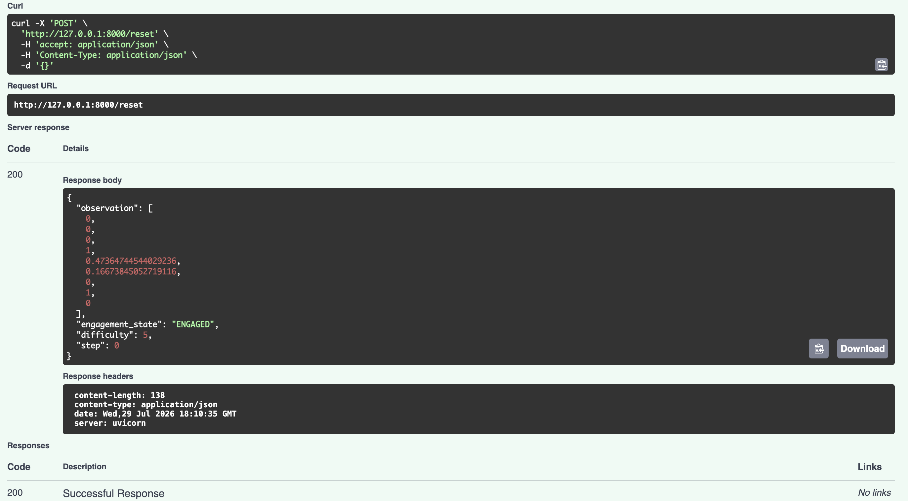
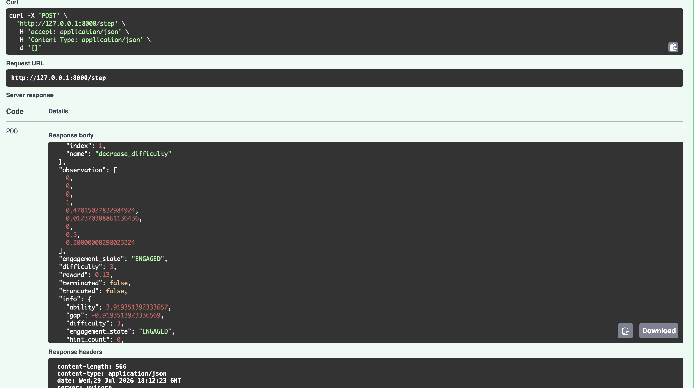
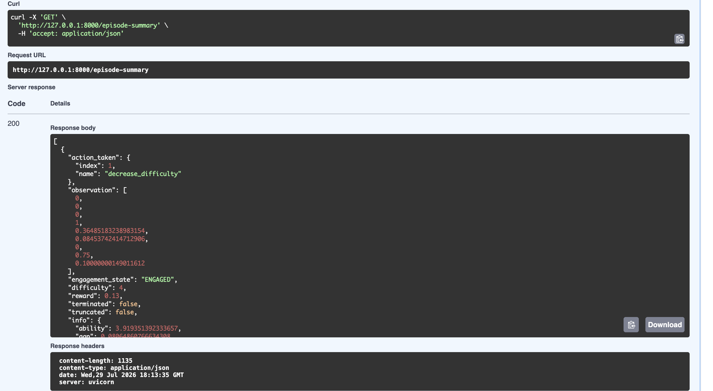

# AdaptLearn-v1 API (bonus demo)

A minimal FastAPI wrapper around AdaptLearn-v1, demonstrating that the
environment's state, actions, and rewards are trivially JSON-serializable
and usable as an API for a frontend. **This is a demonstration, not
production infrastructure**: no authentication, no database, no
deployment config, and a single global in-memory session (no multi-user
handling). It lives entirely under `api/` and does not touch
`environment/`, `training/`, or any of the project's required structure.

## Running it

```bash
uv run uvicorn api.app:app --reload
```

Then visit `http://127.0.0.1:8000/docs` for FastAPI's interactive
Swagger UI, or use the endpoints directly (examples below).

## Endpoints

### `POST /reset`

Loads a trained model (cached in memory after the first load) and starts
a fresh episode.

```bash
curl -X POST http://127.0.0.1:8000/reset \
  -H "Content-Type: application/json" \
  -d '{"algo": "dqn", "seed": 2}'
```

```json
{
  "observation": [0.0, 1.0, 0.0, 0.0, 0.412, 0.231, 0.0, 0.5, 0.0],
  "engagement_state": "BORED",
  "difficulty": 3,
  "step": 0
}
```

`algo` defaults to `"dqn"` (the current best DQN run, `dqn_02`) if
omitted; `seed` is optional. Both `{}` and an empty body are valid.

### `POST /step`

Advances the episode by one action. If `action` is omitted, the
currently-loaded model chooses it via `.predict(obs, deterministic=True)`
-- i.e. the API can drive itself end-to-end with no client-side policy
logic at all.

```bash
curl -X POST http://127.0.0.1:8000/step \
  -H "Content-Type: application/json" \
  -d '{}'
```

```json
{
  "action_taken": { "index": 4, "name": "add_encouragement" },
  "observation": [0.0, 0.0, 0.0, 1.0, 0.388, 0.104, 0.0, 0.5, 0.0],
  "engagement_state": "ENGAGED",
  "difficulty": 3,
  "reward": 0.98,
  "terminated": false,
  "truncated": false,
  "info": {
    "ability": 3.12,
    "gap": -0.12,
    "difficulty": 3,
    "engagement_state": "ENGAGED",
    "hint_count": 0,
    "time_on_task": 1,
    "consecutive_disengaged": 0,
    "topics_completed": 0,
    "session_had_negative": true,
    "steps": 1,
    "last_action": "add_encouragement",
    "last_reward": 0.98,
    "dropout": false,
    "success": false
  }
}
```

Passing an explicit action instead: `-d '{"action": 3}'` (see
`ACTION_NAMES` in `environment/custom_env.py` for the index-to-name
mapping).

### `GET /episode-summary`

Returns every `/step` result so far in the current episode, as a JSON
array -- so a client can render a full playback rather than only the
latest step.

```bash
curl http://127.0.0.1:8000/episode-summary
```

```json
[
  { "action_taken": { "index": 4, "name": "add_encouragement" }, "observation": [...], "...": "..." },
  { "action_taken": { "index": 7, "name": "advance_topic" }, "observation": [...], "...": "..." }
]
```

## Verified via Swagger UI

The three endpoints below were exercised live through FastAPI's
interactive docs (`http://127.0.0.1:8000/docs`) -- not just curl'd from a
terminal -- confirming the actual server, not only the code, works
end-to-end. Note the `/step` call was sent with an empty body (`{}`):
that means no action was supplied by the caller, so the response shown
is the trained model choosing its own action (`decrease_difficulty`)
through the API, exactly as described above.

**`POST /reset`** -- starts a fresh episode with the default model (`dqn`):



**`POST /step`** -- called with `{}`, so the model picks the action itself:



**`GET /episode-summary`** -- returns the accumulated step history as JSON:



## How a real frontend would use this

A web dashboard -- or the existing PyOpenGL classroom renderer,
reimplemented as a browser/canvas view -- would not need to run the
Gymnasium loop or load a Stable-Baselines3 model in Python at all. It
would call `POST /reset` once to start an episode, then either poll
`POST /step` on a timer (e.g. every 2 seconds, mirroring the renderer's
own paced episode playback) to advance the agent one action at a time and
redraw from each response's `engagement_state`/`difficulty`/`reward`, or
call `GET /episode-summary` once an episode has finished to fetch the
whole trajectory and animate it client-side without re-querying the
model at all. Either way, the frontend only ever deals with plain JSON --
the trained model, the environment's internal dynamics, and PyTorch never
need to exist outside this one Python process.
